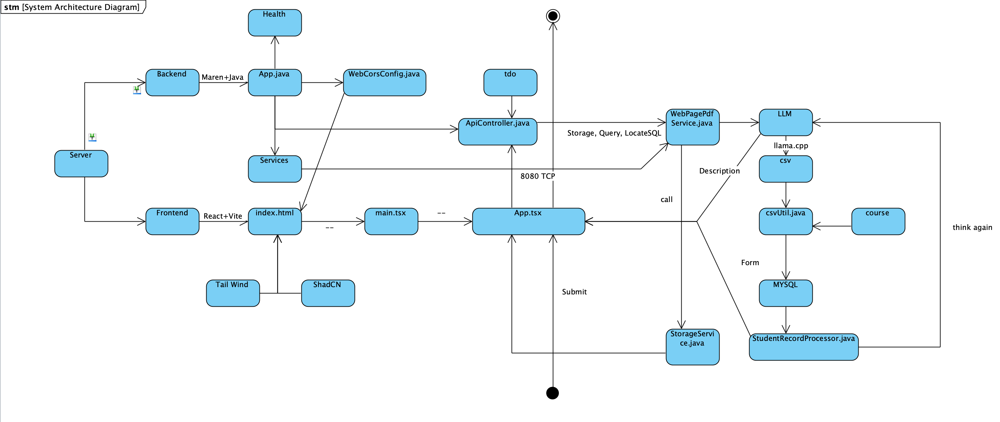

# CourseGuide

A university course recommendation system with a Java Spring Boot backend, React + TypeScript + Vite frontend, and a local Llama LLM for AI-powered course planning.

## System Architecture



---

## Project Structure

```
CourseGuide/
  frontend/                # React + TypeScript + Vite frontend
    src/
      App.tsx              # Main UI (Tailwind CSS, includes workflow panel)
      main.tsx             # Entry point
      App.css              # Minimal reset styles
    index.html
    package.json
    ...
  src/main/java/com/courseguide/
    App.java               # Spring Boot entrypoint
    ApiController.java     # Main API endpoints
    processors/            # Recommendation and data processors
    services/              # Web scraping, LLM, PDF extraction, file storage
    dto/                   # Data transfer objects (records, enums)
    utils/                 # Utility classes
    ...
  pom.xml                  # Maven build file
  ...
```

---

## Prerequisites

- Java 21+ (backend uses Java 21 features)
- Node.js 18+ and npm (frontend development)
- Maven 3.6+ (backend build)
- MySQL 8.0+ (course database and prerequisite DAG)
- Llama API Server running on http://localhost:8075 (local LLM analysis)
- Optional: Playwright (auto-installed by Maven for web scraping)

---

## Backend: How to Build & Run

1. **Compile the backend:**
   ```sh
   cd CourseGuide
   mvn clean package
   ```

2. **Run the backend:**
   ```sh
   java -jar target/courseguide-0.1.0-SNAPSHOT.jar
   ```

   The backend will start at [http://localhost:8080](http://localhost:8080).

---

## Frontend: How to Develop

1. **Install dependencies:**
   ```sh
   cd CourseGuide/frontend
   npm install
   ```

2. **Start the development server:**
   ```sh
   npm run dev
   ```
   The frontend will be available at [http://localhost:5173](http://localhost:5173) and will proxy API requests to the backend.

3. **Build for production:**
   ```sh
   npm run build
   ```

---

## Usage

- Open [http://localhost:5173](http://localhost:5173) for the React frontend.
- Click **"How it works — AI Workflow"** to see the 6-step pipeline explanation.

---

## AI Workflow

The app runs a 6-step AI pipeline when you submit a request:

1. **Student Profile** — Collects university, major, degree level, graduation year, and progress PDF
2. **Web Search** — Queries DuckDuckGo for the university's degree requirements page
3. **Page Scraping** — Uses Playwright to render the page to a PDF snapshot
4. **PDF Text Extraction** — Extracts text from degree requirements and progress PDFs
5. **LLM Analysis** — Sends text to a local Llama model which generates a CSV course plan
6. **Course Selection** — Parses the CSV, builds a prerequisite graph, and selects up to 6 courses

---

## API Endpoints

- `POST /api/recommendations` — Simple recommendations (JSON: `{ major, gpa }`)
- `POST /api/upload-progress` — Upload a progress PDF (multipart/form-data)
- `POST /api/recommendations/profile` — Rich recommendations (JSON profile, can reference uploaded PDF)
- `GET /api/health` — Health check endpoint

---

## Linting & Formatting

- Frontend uses ESLint (see [`frontend/eslint.config.js`](CourseGuide/frontend/eslint.config.js))
- Styling uses Tailwind CSS (loaded via CDN in `index.html`)
- Run `npm run lint` from `CourseGuide/frontend/` to check for issues

---